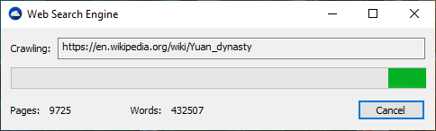

# WebSearchEngine

This project demonstrates the design and implementation of a basic **Web Search Engine**, showcasing key components such as web crawling, indexing, and query processing.

## Overview

The search engine operates by crawling websites, parsing their content, and indexing relevant information for efficient retrieval. It respects the `robots.txt` protocol and extracts metadata such as:

- Page titles
- HTML content
- JavaScript and CSS
- Headings
- Meta tags

## Features

- **Web Crawler**: Navigates through websites, obeying `robots.txt` directives.
- **Indexer**: Processes and stores page content for fast lookup.
- **Query Processor**: Handles user queries and retrieves relevant results.
- **Metadata Extraction**: Captures structured data from HTML for improved relevance.

## How It Works

### 1. Web Crawling
The engine starts by crawling web pages:
- Downloads HTML content from URLs.
- Follows links to discover new pages.
- Respects `robots.txt` rules to avoid restricted areas.

It extracts:
- Page titles
- Headings (`<h1>`, `<h2>`, etc.)
- Meta tags
- JavaScript and CSS references
- Raw HTML content

### 2. Indexing
After crawling, the engine processes and stores content in an index:
- **Tokenization**: Breaks text into searchable words.
- **Normalization**: Lowercases text, removes punctuation, etc.
- **Metadata Storage**: Links each word to the page(s) it appears in, with frequency and position.

### 3. Query Processing
When a user enters a search query:
- Parses the query.
- Looks up relevant terms in the index.
- Ranks pages based on relevance (e.g., term frequency, metadata match).
- Returns results with titles, snippets, and links.

## Technologies Used

- **C++** for core engine logic
- **HTML/CSS/JavaScript** for front-end interface
- **Custom Semaphores** for concurrency control

## Getting Started

To run the project locally:

1. Clone the repository:
   ```bash
   git clone https://github.com/mihaimoga/WebSearchEngine.git
   ```
2. Build the project using your preferred C++ compiler or IDE.
3. Launch the crawler and indexer modules.
4. Use the front-end interface to perform search queries.

## Demo

Visit [`text-mining.ro`](https://text-mining.ro/) for a live demonstration.

## License

This project is licensed under the GNU General Public License v3.0 - see the LICENSE file for details.
